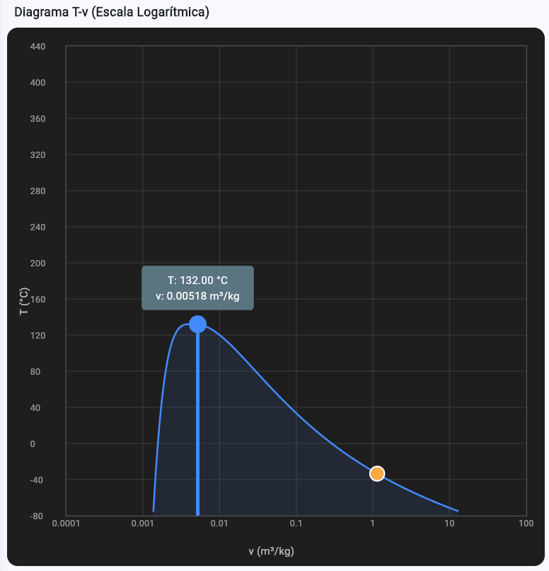
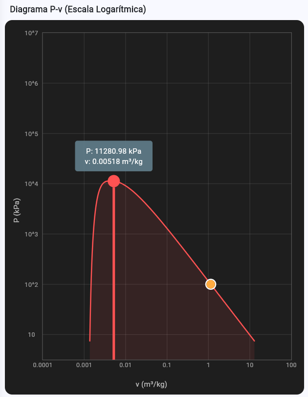

# TermoEngine - Asistente Termodinámico para Amoniaco

<p align="center">
  
</p>

TermoEngine es una aplicación desarrollada en Flutter diseñada para facilitar el cálculo de propiedades termodinámicas del amoniaco ($NH_3$). Utiliza bases de datos integradas en formato JSON para realizar interpolaciones precisas y determinar el estado termodinámico de una sustancia a partir de diversas combinaciones de entrada.

---

## 🚀 Características Principales

- **Cálculo de Propiedades:** Obtención de Presión ($P$), Temperatura ($T$), Volumen específico ($v$), Energía interna ($u$), Entalpía ($h$), Entropía ($s$) y Calidad ($x$).
- **Identificación de Fases:** Detección automática de Líquido Comprimido, Mezcla Saturada (Húmeda) y Vapor Sobrecalentado.
- **Visualización Gráfica:** Generación dinámica de diagramas de estado:
  - Diagrama Temperatura - Volumen específico ($T-v$).
  - Diagrama Presión - Volumen específico ($P-v$).
- **Interpolación Avanzada:** Implementación de lógica de interpolación lineal simple y doble para datos de saturación y sobrecalentado.
- **Soporte Multilingüe:** Interfaz intuitiva y técnica para estudiantes y profesionales de ingeniería.

## 📊 Visualización de Datos

La aplicación integra `fl_chart` para renderizar la campana de saturación y posicionar el punto de estado actual, permitiendo una interpretación visual inmediata del proceso termodinámico.

| Diagrama T-v | Diagrama P-v |
| :---: | :---: |
|  |  |
*Imágenes referenciales de la interfaz de usuario.*

## 🛠️ Arquitectura y Tecnologías

- **Framework:** [Flutter](https://flutter.dev/)
- **Lenguaje:** [Dart](https://dart.dev/)
- **Gráficos:** [fl_chart](https://pub.dev/packages/fl_chart)
- **Persistencia de Datos:** Carga de matrices termodinámicas desde archivos JSON.
- **Gestión de Estado:** Arquitectura limpia separando lógica de datos y presentación.

## 📂 Estructura del Proyecto

- `lib/src/data`: Modelos de datos y lógica de acceso a las tablas JSON.
- `lib/src/presentation`: Pantallas principales, manual de usuario y widgets personalizados para diagramas.
- `assets/`: Tablas de propiedades para Amoniaco (Saturación, Sobrecalentado, Líquido).
- `diagramas_flujo/`: Documentación técnica de la lógica de cálculo y navegación.

## ⚙️ Instalación

1. **Requisitos previos:** Tener instalado el SDK de Flutter.
2. **Clonar el repositorio:**
   ```bash
   git clone https://github.com/tu-usuario/termo_engine.git
   ```
3. **Obtener dependencias:**
   ```bash
   cd termo_engine
   flutter pub get
   ```
4. **Ejecutar la aplicación:**
   ```bash
   flutter run
   ```

## 📖 Uso

1. Seleccione las dos propiedades de entrada conocidas (ej. $P$ y $T$, $T$ y $v$, etc.).
2. Ingrese los valores numéricos.
3. Presione el botón de cálculo.
4. Explore los resultados detallados y los diagramas generados en las pestañas correspondientes.

---

Desarrollado con ❤️ para la comunidad de ingeniería.
